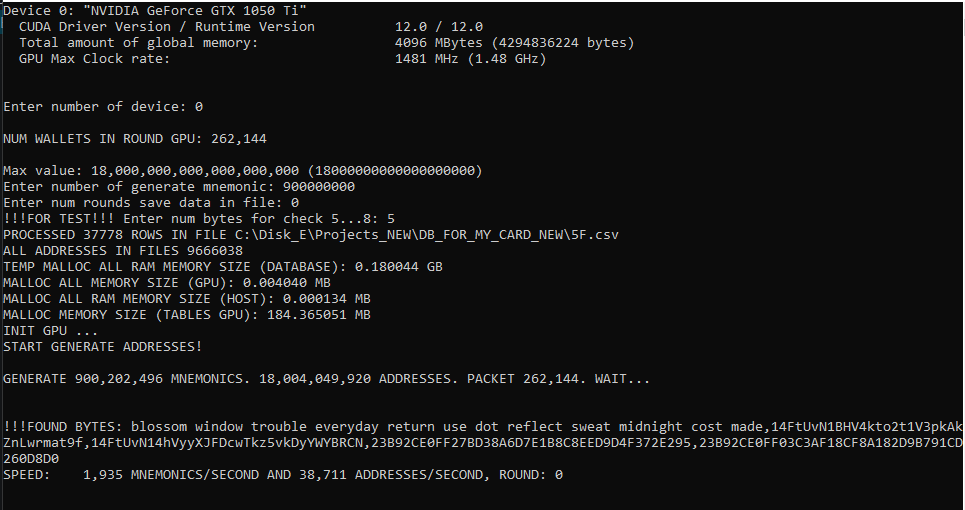

# Brute-force Mnemomonic Old Electrum (V1)
## (Version 1.1)
## Генерация мнемонических фраз Electrum (V1) и соответствующих приватных ключей адресов m/0/x, m/1/x. Поиск адресов в базе.

## Файл config.cfg
* ***"folder_database": "F:\\database"***  - путь к папке с таблицами искомых адресов. Адреса в таблицах должны быть в формате hash160 и отсортированы программой https://github.com/Houzich/Convert-Addresses-To-Hash160-For-Brute-Force
* ***"cuda_grid": 1024*** - настройка под видеокарту
* ***"cuda_block": 256*** - настройка под видеокарту
Кол-во генерируемых мнемоник за раунд равно cuda_grid*cuda_block

## Описание
При запуске программы, считываются настройки из файла config.cfg.
В консоли выводится надпись
> *Detected 3 CUDA Capable device(s)*

где число 3  - это количество найденных видеокарт NVIDIA.
Далее выводятся характеристики каждой карты:
> *Device 0: "NVIDIA GeForce GTX 1050 Ti"*

> *...*

> *Device 1: "NVIDIA GeForce GTX 1050 Ti"*

> *Enter the number of the used video card:*

Нужно ввести номер используемой карты.
Начинается считывание и преобразование файлов баз с адресами:
> *PROCESSED 2168134 ROWS IN FILE F:\\database\A0.csv*
> *.....*

Где 2168134 - это кол-во адресов в файле. Адреса в файле хранятся в 20 байтовом формате в виде hex-строки. И отсортированы по возрастанию.

> *Enter number of generate mnemonic:*

Кол-во мнемоник которое мы хотим генерировать. Это введено для проверки скорости генерации. Если хотим бесконечно, то устанавливаем максимальное значение 18000000000000000000.

> *Enter num cycles save data in file:*

Какое кол-во раундов мы хотим записывать в файл. Введено для проверки правильности генерации. Мнемоника и соответствующие ей адреса записываются в файл Save_Addresses.csv
Запись производится очень медленно. Так как преобразование 20-ти байтного формата в формат WIF производится на ЦПУ.
При проверке скорости выбирать кол-во циклов 0.

> *Enter num bytes for check BIP44 6...8:*

Можно ввести количество байт по которым будет производиться дополнительная сверка. Чтоб пропустить этот шаг, ввести 0.
Если ввести число, то адреса будут проверятmся на совпадение еще и по заданному количеству байт.

Далее выводится кол-во кошельков генерируемых за раунд. И начинается процесс генерации.
В ходе работы программы, постоянно обновляется надпись

> *SPEED: 250,234 MNEMONICS/SECOND AND 2,500,340 ADDRESSES/SECOND, ROUND: 9*

Кол-во мнемоник и кол-во адресов генерируемых за секунду. В данном случае, для каждого сгенерированного кошелька генерировалось 10 адресов. 5 адресов патча m/0/x и пять адресов патча m/1/x

## Проверка на совпадение по байтам
Если при старте программы ввести
> *Enter num bytes for check BIP44 5...8:*

к примеру, 5. То периодически на экране будут появляться надписи такого формата:
> *!!!FOUND BYTES: blossom window trouble everyday return use dot reflect sweat midnight cost made,14FtUvN1BHV4kto2t1V3pkAkZnLwrmat9f,14FtUvN14hVyyXJFDcwTkz5vkDyYWYBRCN,23B92CE0FF27BD38A6D7E1B8C8EED9D4F372E295,23B92CE0FF03C3AF18CF8A182D9B791CD260D8D0*

Мнемоника сгенерированного кошелька. Его адрес. Адрес в базе, который совпал по первым байтам с адресом мнемоники. И соответственно, их представление в 20-и байтовом формате hash160. Можно посчитать одинаковые байты и убедиться в этом.
Все эти адреса сохраняются в лог-файл Found_Bytes.csv.
В файле, строки хранятся в виде:
*usual disagree error juice gap renew jacket toe circle goose tank prefer,15JMEsfkJSE1BJ3FjyMFZheAtpn7qLyHUs,15JMEsfjbTyHN6Wf9x2HA7XnqfVqdgD4kD,2F28782544E96EBEC694FFF37AC20FD2B6389ABD,2F2878254409A3E553D017294757CC2DDF4A2E99,Fri Feb  3 11:40:56 2023*

# Если нашли кошелек
В консоли появиться надписи:
> * !!!FOUND!!!
!!!FOUND!!!
!!!FOUND!!!
!!!FOUND!!!
!!!FOUND: emotion first beard escape shield rough flame carefully dish handle really dad, 17oaREDuDrWg1ECCyQZHwNJJyWTp3Bfnw1
!!!FOUND!!!
!!!FOUND!!!
!!!FOUND!!!
!!!FOUND!!!*

Соответственно мнемоника и адрес который мы нашли. И информация добавиться в файл Found_Addresses.csv.
В файле строки хранятся в виде:
*emotion first beard escape shield rough flame carefully dish handle really dad, 17oaREDuDrWg1ECCyQZHwNJJyWTp3Bfnw1,Fri Feb  3 12:21:27 2023*

## Файл BruteForceMnemonicOldV11.exe находится в папке exe

### ОБСУЖДЕНИЕ КОДА: https://t.me/BRUTE_FORCE_CRYPTO_WALLET